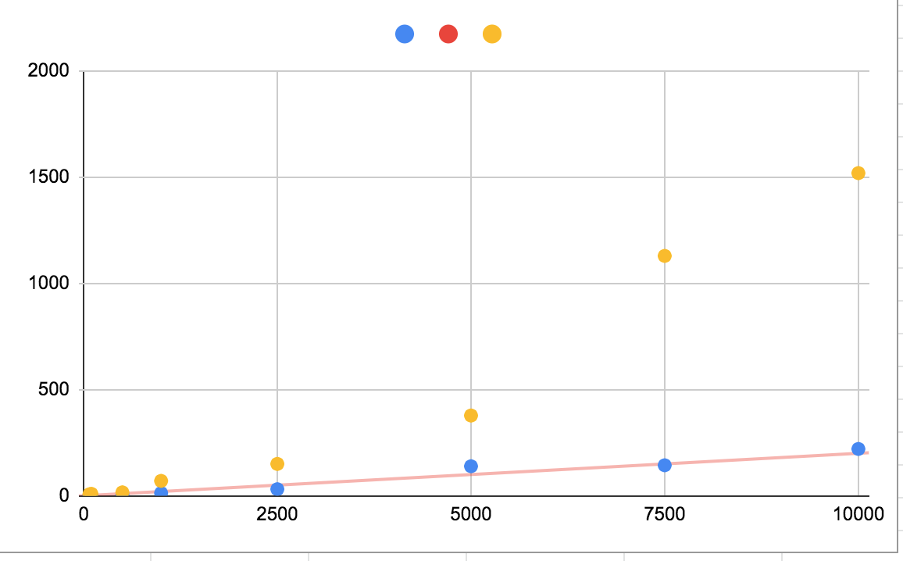

# Comparision of sorting algorithms

| num of elements | counting sort | tim sort |
|-----------------|---------------|----------|
| 75,000          | 1             | 7        |
| 100,000         | 1.5           | 9        |
| 500,000         | 4.6           | 16       |
| 1,000,000       | 12.75         | 70       |
| 2,500,000       | 31            | 150      |
| 5,000,000       | 139           | 378      |
| 7,500,000       | 143.6         | 1130     |
| 10,500,000      | 220.5         | 1520     |

Legend:
* Blue is counting sort
* Red is lineal trending
* Yellow is Tim sort
